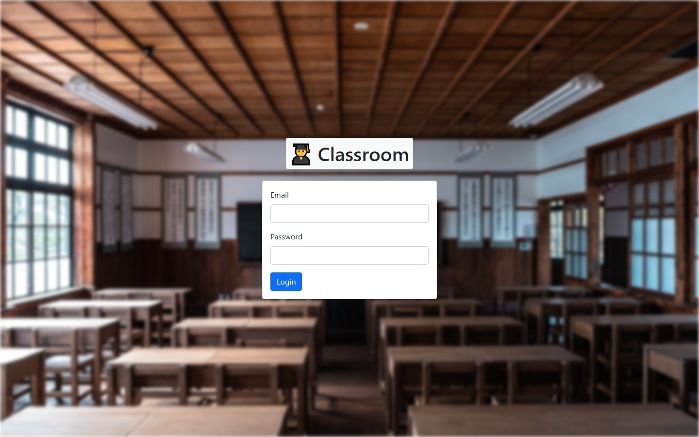
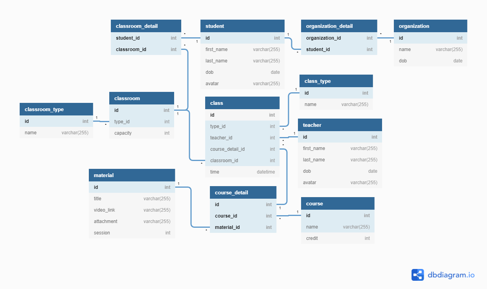

# DB-WebApp

[:tada: Click here to see our live demo!](https://dbwebapptest.000webhostapp.com/)



A project for DBMS course on Binus University.

## ERD Diagram

|                                                                                                                                  |
| :---------------------------------------------------------------------------------------------------------------------------------------------------: |
| [Lucid Chart](https://lucid.app/lucidchart/e803c288-aad0-4268-bbab-7007388bd60f/edit?invitationId=inv_12158997-fda3-4caf-b31f-216c213d051a&page=0_0#) |

## Tech Stack

- Bootstrap 5
- PHP (8.1)
- MySQL
- Apache

## Run Locally

### Start XAMPP(PHP, MySQL, Apache)

- **Windows**: _please read the documentation on how to run it_
- **Mac**: _please read the documentation on how to run it_
- **Linux**:
  ```bash
  $ sudo /opt/lampp/lampp start
  ```

### Clone the project

```bash
  git clone https://github.com/CharlesKristov/DB-WebApp
```

To make life easier, make sure to put the cloned project directory in `htdocs` folder. This can be found in:

- **Windows** : `C:/xampp/htdocs`
- **Linux** : `/opt/lampp/htdocs`

### Database setup

1. Open browser and navigate to `localhost/phpmyadmin`.
2. Create a new database named `student_database`.
3. Import [student_database.sql](./student_database.sql) that is included in the project directory to the database.
4. Make sure every query successfully executed.

Navigate to [localhost/DB-WebApp](http://localhost/DB-WebApp) and login with one of the secrets in [secrets](./.secrets).

## Authors

|      |  |  |
| :---------------------------: | :----------------------: | :--------------------: |
|      Charles Christopher      |       Oliver Chico       |   Made Agustha I.S.    |
|          2440062924           |        2440055635        |       2440048970       |
| [@CharlesKristov][gh-charles] |   [@Oiko78][gh-chico]    |  [@agusthas][gh-made]  |

[gh-chico]: https://github.com/Oiko78
[gh-charles]: https://github.com/CharlesKristov
[gh-made]: https://www.github.com/agusthas
